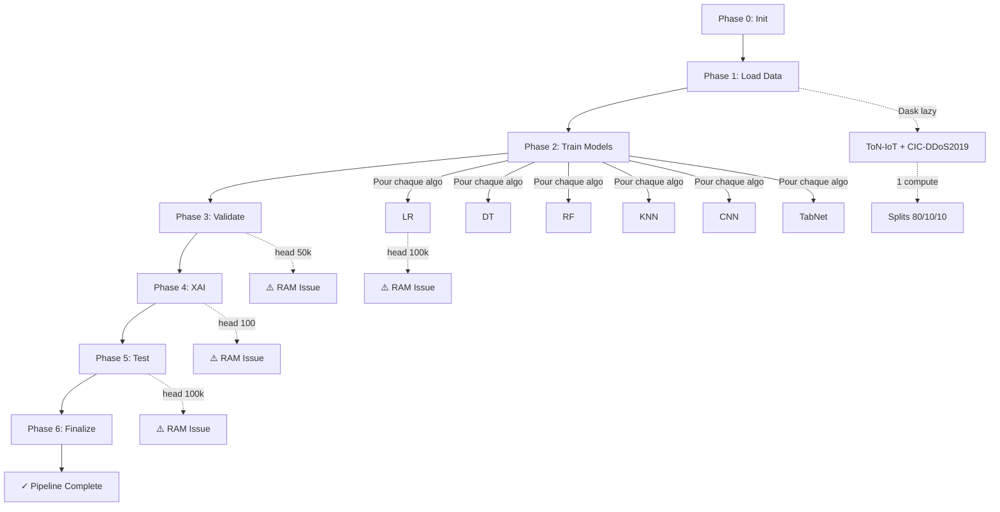

# Pipeline Workflow - TON IoT DDoS Detection

## 🔄 WORKFLOW COMPLET

Ce workflow définit la séquence exacte des étapes pour exécuter le pipeline de détection DDoS.

---

## Phase 0: Initialisation

### Étape 0.1: Configuration Environment
```bash
# Activer environnement virtuel
source .toniot/bin/activate

# Vérifier dépendances
python -c "import dask, torch, sklearn, pandas; print('✓ Toutes dépendances OK')"
```

### Étape 0.2: Vérifier Datasets
```bash
# Vérifier présence datasets
test -f datasets/ton_iot/train_test_network.csv && echo "✓ ToN-IoT OK"
test -d datasets/cic_ddos2019 && echo "✓ CIC-DDoS2019 OK"
```

### Étape 0.3: Initialiser Monitoring
- Démarrer SystemMonitor avec limite RAM 50%
- Initialiser Dask LocalCluster (2 workers, limite mémoire 45% RAM totale)
- Créer répertoire output `rr/` (nettoyé si existe)

**Critère de Succès**: Environment prêt, datasets accessibles, monitoring actif

---

## Phase 1: Chargement Données (Data Loading)

### Étape 1.1: Initialiser DataLoader
```python
from src.new_pipeline.data_loader import RealDataLoader
loader = RealDataLoader(monitor=monitor, rr_dir=RR_DIR)
```

### Étape 1.2: Charger Datasets (Lazy)
```python
# Opérations Dask lazy - pas de compute()
loader.load_datasets(
    ton_iot_path=TON_IOT_PATH,
    cic_ddos_dir=CIC_DDOS_DIR,
    sample_ratio=sample_ratio  # 0.001 en test-mode, 1.0 en prod
)
```

**Actions**:
- Lecture CSV ToN-IoT avec `dd.read_csv()` (lazy)
- Recherche récursive fichiers CIC-DDoS2019 `**/*.csv`
- Mapping labels: `normal/BENIGN → 0`, `ddos/autres → 1`
- Harmonisation colonnes communes
- Ajout colonne `dataset` ('ton_iot' ou 'cic_ddos2019')
- Concat Dask (toujours lazy)

### Étape 1.3: Profiling & Validation
```python
loader.profile_and_validate()
```

**Actions**:
- **UNIQUE compute()** sur `value_counts()` pour statistiques
- Split train/val/test (80/10/10) avec `random_split()` Dask
- Génération graphique distribution classes
- Sauvegarde `rr/phase1_distribution.png`

**Critère de Succès**:
- Dask DataFrame chargé (lazy)
- Splits créés (train_ddf, val_ddf, test_ddf)
- Distribution classes affichée
- RAM < 60%

---

## Phase 2: Entraînement (Training)

### Étape 2.1: Extraction Features
```python
all_features = [c for c in train_ddf.columns 
                if c not in ["is_ddos", "label", "type", "dataset"]]
X_train = train_ddf[all_features]  # Reste lazy
y_train = train_ddf["is_ddos"]
```

### Étape 2.2: Itération sur Algorithmes
Pour chaque algorithme dans `['LR', 'DT', 'RF', 'KNN', 'CNN', 'TabNet']`:

#### 2.2.1: Initialiser Trainer
```python
trainer = PipelineTrainer(random_state=42)
```

#### 2.2.2: Entraîner Modèle
```python
trainer.train_single(algo_name, X_train, y_train)
```

**Actions internes**:
- **Conversion Dask→Pandas**: `X_train.head(100000)`
  - ⚠️ **PROBLÈME ACTUEL**: Pas de contrôle RAM
  - 🔧 **À IMPLÉMENTER**: MemoryAwareProcessor
- Sélection colonnes numériques: `select_dtypes(include=[np.number])`
- Remplissage NaN: `fillna(0)`
- Entraînement modèle spécifique:
  - **Sklearn** (LR, DT, RF, KNN): `model.fit(X, y)`
  - **CNN**: Training loop PyTorch (20 epochs)
  - **TabNet**: `model.fit()` avec early stopping

#### 2.2.3: Sauvegarder Résultats
- Stocker dans `trainer.models[name]`
- Enregistrer `training_times[name]`
- Enregistrer `history[name]` (loss/accuracy par epoch)

#### 2.2.4: Visualisation
```python
trainer.plot_results(output_dir=RR_DIR)
```

**Graphiques générés**:
- `phase2_training_times.png` - Bar chart temps
- `phase2_convergence_{algo}.png` - Courbes loss/accuracy

**Critère de Succès**:
- 6 modèles entraînés
- Historique training sauvegardé
- Graphiques générés
- RAM < 70%

---

## Phase 3: Validation (Hyperparameter Tuning)

### Étape 3.1: Initialiser Validator
```python
validator = PipelineValidator(models=trainer.models, random_state=42)
```

### Étape 3.2: Tuning pour Chaque Algo
```python
validator.validate_tuning(X_val, y_val, RR_DIR, algo_name=algo)
```

**Actions**:
- **Conversion Dask→Pandas**: `X_val.head(50000)`
  - ⚠️ **PROBLÈME**: Même issue RAM
- Grid search sur hyperparamètres (définis dans `config.py`)
- Pour chaque combinaison:
  - Fit modèle avec params
  - Évaluation: Accuracy, F1, AUC
  - Log résultats
- Sélection meilleurs paramètres (max F1)

### Étape 3.3: Visualisation Tuning
**Graphiques générés**:
- `phase3_tuning_{algo}.png` - Variation param vs scores

**Critère de Succès**:
- Meilleurs params identifiés pour chaque algo
- Graphiques tuning sauvegardés
- RAM < 70%

---

## Phase 4: Explainabilité (XAI Validation)

### Étape 4.1: Initialiser XAI Manager
```python
xai = XAIManager(rr_dir=RR_DIR)
```

### Étape 4.2: Évaluation XAI
```python
xai.validate_xai(models=trainer.models, X_test=X_test, y_test=y_test, algo_name=algo)
```

**Actions**:
- **Conversion Dask→Pandas**: `X_test.head(100)` (très petit sample)
  - ⚠️ **PROBLÈME**: Même pattern non sécurisé
- Pour chaque méthode XAI (`['SHAP', 'LIME', 'FI']`):
  - Mesurer **Fidelity**: Fidélité explicabilité
  - Mesurer **Stability**: Consistance explications
  - Mesurer **Complexity**: Sparsité features
  - Calculer **Composite Score** (pondéré)

### Étape 4.3: Visualisation XAI
**Graphiques générés**:
- `phase4_xai_metrics_{algo}.png` - Radar chart métriques XAI

**Critère de Succès**:
- Scores XAI calculés (3 métriques × 3 méthodes)
- Meilleure méthode XAI sélectionnée
- Graphiques générés

---

## Phase 5: Test (Final Evaluation)

### Étape 5.1: Initialiser Tester
```python
tester = PipelineTester(models=trainer.models, rr_dir=RR_DIR)
```

### Étape 5.2: Évaluation Finale
```python
tester.evaluate_all(X_test, y_test, algo_name=algo)
```

**Actions**:
- **Conversion Dask→Pandas**: `X_test.head(100000)`
  - ⚠️ **PROBLÈME**: Même issue RAM
- Prédictions sur test set
- Calcul métriques:
  - Accuracy
  - F1-Score
  - Precision
  - Recall
  - AUC
- Analyse overfitting/underfitting:
  - Si F1 > 0.98: ⚠️ Alerte overfitting
  - Si F1 < 0.5: ⚠️ Alerte underfitting

### Étape 5.3: Visualisations Finales
**Graphiques générés**:
- `phase5_metrics_synthesis.png` - Comparaison tous algos
- `phase5_final_report.txt` - Rapport textuel détaillé

**Critère de Succès**:
- Métriques finales calculées (6 algos × 5 métriques)
- Rapport final généré
- Graphiques comparatifs sauvegardés

---

## Phase 6: Finalisation & Rapports

### Étape 6.1: Feature Analysis
```python
from src.core.feature_categorization import categorize_features
categorized = categorize_features(all_features)
```

**Actions**:
- Catégorisation features (Flow ID, Basic Stats, Packet Length, etc.)
- Calcul scores par catégorie
- Affichage verbose expert

### Étape 6.2: Génération Diagrammes
```python
from src.core.dependency_graph import generate_er_dependency_diagram
generate_er_dependency_diagram(RR_DIR / "pipeline_er_diagram.png")
```

### Étape 6.3: Resource Monitoring
```python
monitor.plot_resource_consumption(str(RR_DIR / "resource_consumption.png"))
monitor.generate_timeline_heatmap(str(RR_DIR / "execution_timeline.png"))
```

**Graphiques générés**:
- `resource_consumption.png` - CPU/RAM par phase
- `execution_timeline.png` - Timeline exécution

### Étape 6.4: Analyses Supplémentaires
**Graphiques générés**:
- `correlation_matrix.png` - Heatmap corrélations features
- `feature_importance_heatmap.png` - Top 30 features
- `category_metrics.png` - Scores catégories

### Étape 6.5: Cleanup
```python
monitor.stop_monitoring()
client.close()
cluster.close()
```

**Critère de Succès**:
- Tous graphiques générés dans `rr/`
- Rapport final complet
- Resources libérées proprement

---

## 🎯 RÉSUMÉ WORKFLOW COMPLET



---

## 📊 POINTS DE CONTRÔLE (Checkpoints)

### Checkpoint 1: Après Phase 1
- ✅ Datasets chargés (lazy)
- ✅ Splits créés
- ✅ Distribution visualisée
- ✅ RAM < 60%

### Checkpoint 2: Après Phase 2
- ✅ 6 modèles entraînés
- ✅ Training times enregistrés
- ✅ Convergence visualisée
- ✅ RAM < 70%

### Checkpoint 3: Après Phase 3
- ✅ Hyperparams optimisés
- ✅ Tuning visualisé
- ✅ RAM < 70%

### Checkpoint 4: Après Phase 4
- ✅ XAI évalué (3 méthodes)
- ✅ Scores calculés
- ✅ RAM < 70%

### Checkpoint 5: Après Phase 5
- ✅ Test metrics finales
- ✅ Rapport généré
- ✅ RAM < 80%

### Checkpoint 6: Fin Pipeline
- ✅ Tous graphiques générés
- ✅ Resources libérées
- ✅ Logs sauvegardés

---

## ⚠️ PROBLÈMES CONNUS & SOLUTIONS

### Problème 1: Conversions Dask→Pandas Non Contrôlées
**Localisation**: Phases 2, 3, 4, 5

**Impact**: RAM peut monter à 93%

**Solution à Implémenter**: MemoryAwareProcessor
```python
# Au lieu de:
X_train_pd = X_train.head(100000)

# Utiliser:
X_train_pd = memory_mgr.safe_compute(X_train, "training_X")
```

### Problème 2: Gestion Erreurs Basique
**Localisation**: Toutes phases

**Impact**: Erreurs silencieuses, pas de retry

**Solution à Implémenter**: Framework exceptions personnalisées

### Problème 3: Pas de Résumabilité
**Impact**: Si crash, tout recommencer

**Solution Future**: PipelineOrchestrator avec checkpoints

---

## 🔄 MODES D'EXÉCUTION

### Mode Test (--test-mode)
```bash
python3 main.py --test-mode
```
- Sample ratio: 0.1% des données
- Exécution rapide (~5 minutes)
- RAM < 50%
- Pour développement/debug

### Mode Partiel (--sample-ratio X)
```bash
python3 main.py --sample-ratio 0.5
```
- Sample ratio: 50% des données
- Exécution moyenne (~30 minutes)
- RAM < 70%
- Pour validation intermédiaire

### Mode Production (défaut)
```bash
python3 main.py
```
- Sample ratio: 100% des données
- Exécution longue (~2-3 heures)
- RAM < 80%
- Pour résultats finaux

---

## 📁 OUTPUTS GÉNÉRÉS

Tous les fichiers sont dans `rr/`:

### Phase 1
- `phase1_distribution.png`

### Phase 2
- `phase2_training_times.png`
- `phase2_convergence_lr.png`
- `phase2_convergence_dt.png`
- `phase2_convergence_rf.png`
- `phase2_convergence_knn.png`
- `phase2_convergence_cnn.png`
- `phase2_convergence_tabnet.png`

### Phase 3
- `phase3_tuning_lr.png`
- `phase3_tuning_dt.png`
- `phase3_tuning_rf.png`
- `phase3_tuning_knn.png`

### Phase 4
- `phase4_xai_metrics_*.png`

### Phase 5
- `phase5_metrics_synthesis.png`
- `phase5_final_report.txt`

### Phase 6
- `resource_consumption.png`
- `execution_timeline.png`
- `correlation_matrix.png`
- `feature_importance_heatmap.png`
- `category_metrics.png`
- `pipeline_er_diagram.png`

---

## ✅ CRITÈRES DE SUCCÈS GLOBAL

- ✅ Pipeline complète sans crash
- ✅ RAM reste < 80% en tout temps
- ✅ 6 modèles entraînés et évalués
- ✅ Tous graphiques générés
- ✅ Rapport final produit
- ✅ Logs propres (pas d'erreurs)
- ✅ Temps exécution raisonnable
- ✅ Métriques cohérentes (F1 > 0.7)

---

Ce workflow décrit le flux complet actuel avec les points d'amélioration identifiés marqués ⚠️.
