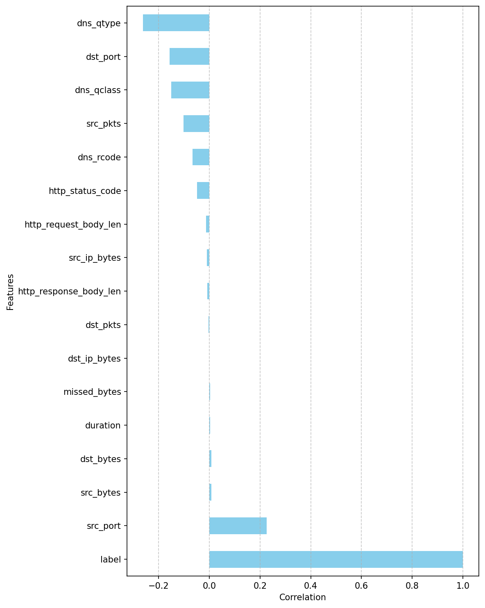
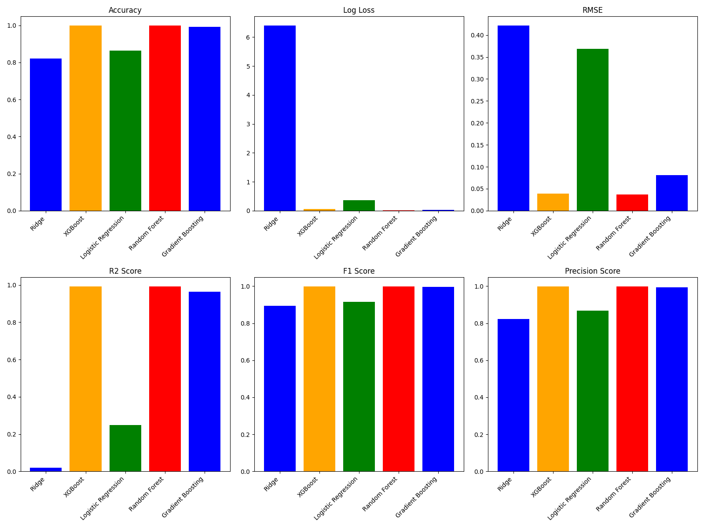
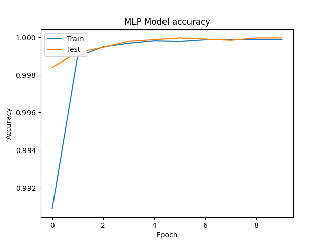
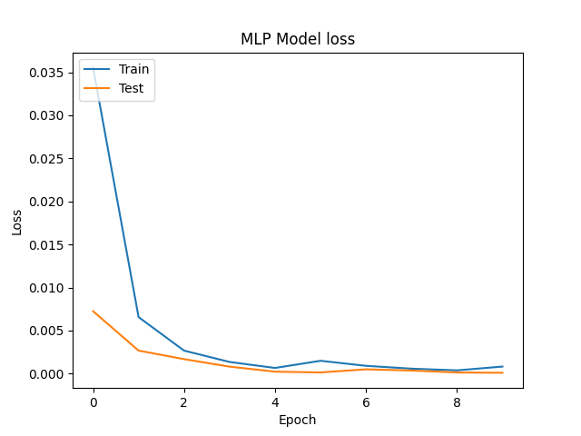

# Evaluating the Performance of Machine Learning-Based Classification Models for IoT Intrusion Detection (2024 IEEE ORSS)

<a href="https://doi-org.libpublic3.library.isu.edu/10.1109/ORSS62274.2024.10697949"></a> 
<a href="https://www.researchgate.net/publication/384580344_Evaluating_the_Performance_of_Machine_Learning-Based_Classification_Models_for_IoT_Intrusion_Detection"></a>

       

## Abstract
As the Internet of Things (IoT) continues to expand its footprint across various sectors, including healthcare, industrial automation, and smart homes, the security of these interconnected devices becomes paramount. With the proliferation of IoT devices, the attack surface for potential cybersecurity threats has significantly increased, necessitating the development of efficient Intrusion Detection Systems (IDS). This study embarks on a comprehensive examination of several machine learning algorithms aimed at enhancing the prediction accuracy of IDS within IoT networks. Leveraging the ToN-IoT dataset, we implement and compare the effectiveness of models. The findings reveal that ensemble methods, particularly Random Forest and XGBoost, exhibit superior performance, underscoring their potential for deployment in safeguarding IoT ecosystems against malicious intrusions. <br>
## ToN-IoT Dataset
The Ton-IoT [dataset](https://research.unsw.edu.au/projects/unsw-nb15-dataset) used is one of the datasets that were collected from a realistic and large-scale designed network by the Australian Defence Force Academy (ADFA).
This is the [link](https://drive.google.com/file/d/1CAdK9IgIr74RvtR60OdJBuiXKy37egWg/view?usp=sharing) to the used dataset.


## System model
The architecture of our solution is described in the figure below and is divided into 4 main steps: data acquisition, data pre-
processing, data manipulation, and algorithms implementation and evaluation.
<br>


## Running the code
To run the code and find the results, please clone this project and download the data. The data path should be the same as the one used in the code. <br> 
`data_training.py` is dedicated for the Machine Learning models and `RL_training.py` for the reinforcement learning implementation. 

### TO NOTE
In the code, We developed models other than the tested models, where we included both Deep Learning (Multilayer Perceptrons (MLP)) models and Reinforcement Learning (DQN) setup.
## Results
First, we explored the data and we deducted a correlation analysis as in the figure below: <br>



The main results are illustrated in the table and figure below:
<br>

<br>

### Model Evaluation Metrics

| Model                | Accuracy   | Log Loss       | RMSE      | F1 Score  | Precision Score | R2 Score   |
|----------------------|------------|----------------|-----------|-----------|-----------------|------------|
| Ridge                | 0.822502   | **0.6397665**  | 0.421305  | 0.893667  | 0.822655        | 0.019612   |
| XGBoost              | **0.998484** | 0.054652     | **0.038939** | **0.999006** | 0.998820        | **0.991625** |
| Logistic Regression  | 0.863986   | 0.368590       | 0.368800  | 0.915657  | 0.868558        | 0.248745   |
| Random Forest        | **0.998484** | **0.006544**  | **0.038939** | 0.999006  | **0.998913**     | **0.991625** |
| Gradient Boosting    | 0.993390   | 0.032367       | 0.081302  | 0.995674  | 0.993810        | 0.963491   |

Next, we used the Multilayer Perceptrons (MLP) in Deep Learning and the Deep Q-Network in Reinforcement Learning on the same data, and the performances are as follows: <br>




### Performance Metrics of the MLP Model

| **Metric**   | **Value**   |
|--------------|-------------|
| R2 Score     | 0.9994765   |
| Log Loss     | 0.0002139   |
| Precision    | 1.0         |
| F1 Score     | 0.9999378   |
| RMSE         | 0.0097348   |
| Accuracy     | 0.9999052   |


## Citation
Please do not hesitate to contribute to this project and cite us:
```
@INPROCEEDINGS{10697949,
  author={Kaddour, Hamza and Das, Shaibal and Bajgai, Rishikesh and Sanchez, Amairanni and Sanchez, Jason and Chiu, Steve C. and Ashour, Ahmed F. and Fouda, Mostafa M.},
  booktitle={2024 IEEE Opportunity Research Scholars Symposium (ORSS)}, 
  title={Evaluating the Performance of Machine Learning-Based Classification Models for IoT Intrusion Detection}, 
  year={2024},
  volume={},
  number={},
  pages={84-87},
  keywords={Machine learning algorithms;Biological system modeling;Ecosystems;Intrusion detection;Smart homes;Predictive models;Data models;Internet of Things;Random forests;Optimization;IoT security;intrusion detection systems;cyber-security threats;IoT networks;malicious intrusions;safeguarding IoT ecosystems},
  doi={10.1109/ORSS62274.2024.10697949}}
```
You can find an extension to this paper where included the DL and RL and comparison in the following [document](https://drive.google.com/file/d/1Z0cyVbdsaaw-EuPd6IidkRskHtIQmqM-/view?usp=sharing). <br>
If you find this project interesting, please do not hesitate to reach out to me for any recommendations, questions, or suggestions.
[Email me](mailto:hamzakaddour@isu.edu)
